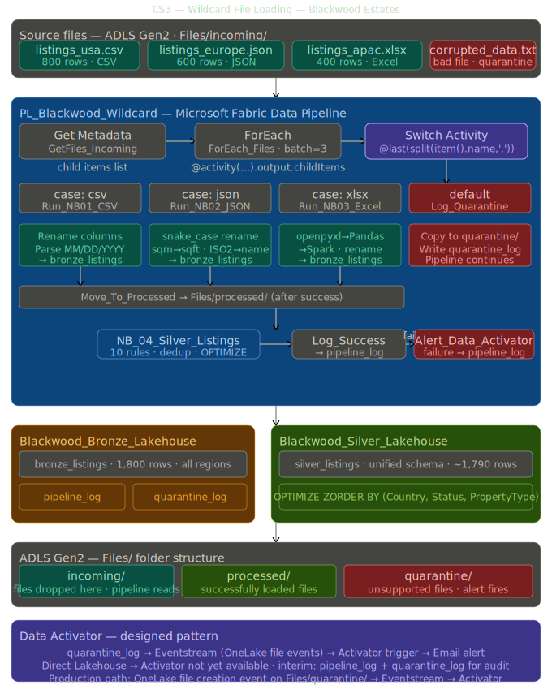

# Case Study 03 — Wildcard File Loading Pipeline

**Industry:** Luxury Real Estate — Global Multi-Region Agency  
**Platform:** Microsoft Fabric — Data Factory + Lakehouse + PySpark  
**Stack:** ADLS Gen2 · Delta Lake · PySpark · Switch Activity   

---

## Business Problem

Blackwood Estates operates across 14 countries, managing 8,400 active property listings globally. Three regional offices — North America, Europe, and Asia-Pacific — each export listing data monthly in different formats with no agreed schema, no naming convention, and no arrival schedule.

| Pain Point | Business Impact |
|---|---|
| 3 different file formats (CSV, JSON, Excel) | No single pipeline could ingest all three |
| Column names differ per region | `ListingPrice` vs `asking_price` vs `Price_USD` |
| Date formats differ per region | MM/DD/YYYY vs DD-MM-YYYY vs YYYY/MM/DD |
| Area units differ | sqft (USA/APAC) vs sqm (Europe) |
| Country format differs | Full name vs ISO2 code vs Full name |
| No arrival schedule | Files land anytime — no trigger |
| No error handling | Bad files silently corrupted the master spreadsheet |
| Manual process | Analyst spent 3 days per month consolidating files in Excel |

---

## Solution

An automated wildcard file loading pipeline in Microsoft Fabric using the **metadata-driven pattern** — the pipeline discovers files dynamically, classifies them by extension, routes each to the correct processing notebook, quarantines unsupported formats, and moves processed files automatically.

```
ADLS Gen2 — Files/incoming/
├── listings_usa.csv         ← picked up automatically
├── listings_europe.json     ← picked up automatically
├── listings_apac.xlsx       ← picked up automatically
└── corrupted_data.txt       ← quarantined automatically
         ↓
PL_Blackwood_Wildcard
├── Get Metadata             →  lists all files in incoming/
├── ForEach                  →  loops over every file found
│   └── Switch (@last(split(item().name,'.')))
│       ├── case csv         →  NB_01_Ingest_CSV  + Move_To_Processed
│       ├── case json        →  NB_02_Ingest_JSON + Move_To_Processed
│       ├── case xlsx        →  NB_03_Ingest_Excel + Move_To_Processed
│       └── Default          →  Log_Quarantine + Move_To_Quarantine
├── Run_NB04_Silver          →  unify all sources → silver_listings
└── Log_Success              →  write to pipeline_log
         ↓
Blackwood_Bronze_Lakehouse   →  bronze_listings (1,800 rows)
Blackwood_Silver_Lakehouse   →  silver_listings (unified schema)
Files/processed/             →  3 files moved here after success
Files/quarantine/            →  1 file quarantined
```

---

## Architecture



---

## Key Technical Decisions

**Why Switch activity instead of nested If Condition activities?**  
The Switch activity evaluates the file extension expression once and routes directly to the matching case — O(1) routing. Nested If Condition activities evaluate sequentially — every file passes through the CSV check before the JSON check. Switch is faster, more readable, and makes routing logic immediately visible in the pipeline canvas without drilling into each branch.

**Why separate notebooks per file format?**  
Each notebook is independently testable and deployable. If the JSON reader breaks due to a schema change from the European office, NB_02 can be fixed and redeployed without touching NB_01 or NB_03. A single notebook with if/else logic creates one point of failure — a syntax error in the Excel section breaks CSV processing too.

**Why Get Metadata + ForEach instead of hardcoded file names?**  
Hardcoding means every new regional office requires a pipeline code change. Get Metadata reads whatever is in the folder — new files are picked up automatically with zero pipeline changes. The pipeline describes what to do with a file, not which files to process.

**Why idempotent Bronze notebooks?**  
Before each append to `bronze_listings` the notebook deletes existing rows for that SourceRegion: `target.delete("SourceRegion = 'USA'")`. This means any notebook can be rerun safely any number of times and always produces the same result. Without this a rerun doubles the row count.

**Why convert sqm to sqft in Bronze?**  
Area unit conversion is deterministic and lossless — 1 sqm = 10.764 sqft always. Converting in Bronze means Silver and Gold never need to know which unit a row originally used. If conversion happened in Silver or Gold, a join failure or missing source tag would produce silently wrong area values.

**Why resolve ISO2 country codes in Bronze?**  
Power BI maps and geographic charts require full country names. Resolving codes early means Silver and Gold always have consistent country values regardless of source. A WHEN chain handles the 6 European country codes in our dataset — a lookup table would be appropriate at 50+ countries.

**Data Activator design decision:**  
Data Activator was designed to monitor the `quarantine_log` Delta table and fire an email alert when unresolved entries are detected. The current Fabric Activator supports connections via Power BI semantic models or Eventstreams — direct Lakehouse table connections are not yet available as of April 2026. The recommended production implementation uses OneLake events via Eventstream to detect new files written to `Files/quarantine/` and routes them to a Fabric Activator trigger. As an interim measure `quarantine_log` provides full audit visibility and `pipeline_log` tracks quarantine counts per run.

---

## Pipeline Activities

| Activity | Type | Purpose |
|---|---|---|
| `GetFiles_Incoming` | Get Metadata | Lists all files in `Files/incoming/` — returns child items array |
| `ForEach_Files` | ForEach | Loops over every file — `@activity('GetFiles_Incoming').output.childItems` |
| `Switch1` | Switch | Routes by extension — `@last(split(item().name,'.'))` |
| `Run_NB01_CSV` | Notebook | Ingests CSV files — passes `file_name` parameter |
| `Run_NB02_JSON` | Notebook | Ingests JSON files — passes `file_name` parameter |
| `Run_NB03_Excel` | Notebook | Ingests Excel files — passes `file_name` parameter |
| `Log_Quarantine` | Notebook | Logs unsupported file to `quarantine_log` Delta table |
| `Move_To_Processed` | Copy data | Moves file from `incoming/` to `processed/` |
| `Move_To_Quarantine` | Copy data | Moves file from `incoming/` to `quarantine/` |
| `Run_NB04_Silver` | Notebook | Rebuilds `silver_listings` from unified `bronze_listings` |
| `Log_Success` | Notebook | Writes run summary to `pipeline_log` Delta table |
| `Alert_Data_Activator` | Notebook | Logs failure to `pipeline_log` on any pipeline error |

---

## Schema Conflicts Resolved

The core engineering challenge of CS3 is unifying three completely different schemas into one.

| Concept | USA CSV | Europe JSON | APAC Excel | Unified Silver |
|---|---|---|---|---|
| Listing ID | `ListingID` | `listing_id` | `PropertyRef` | `ListingID` |
| Price | `ListingPrice` | `asking_price` | `Price_USD` | `ListingPrice` |
| Bedrooms | `Bedrooms` | `num_bedrooms` | `BedCount` | `Bedrooms` |
| Bathrooms | `Bathrooms` | `num_bathrooms` | `BathCount` | `Bathrooms` |
| Area | `SqFt` (sqft) | `area_sqm` (sqm) | `FloorArea_sqft` (sqft) | `AreaSqFt` (always sqft) |
| Date | `ListDate` MM/DD/YYYY | `listed_on` DD-MM-YYYY | `DateListed` YYYY/MM/DD | `ListDate` yyyy-MM-dd |
| Country | Full name | ISO2 code | Full name | Full name always |
| Status | Active/Sold/Under Contract | active/sold | Available/Sold | Active/Sold/Other |
| Agent | `AgentName` | `agent_name` | `ListingAgent` | `AgentName` |

---

## Data Quality Rules — NB_04_Silver_Listings

| Rule | What it checks | Action |
|---|---|---|
| 1 | Null `ListingID` | Drop — cannot identify without primary key |
| 2 | Null or zero `ListingPrice` | Drop — invalid financial record |
| 3 | Null `City` | Drop — cannot do geographic analysis |
| 4 | Null `ListDate` | Drop — cannot do time analysis |
| 5 | Negative `Bedrooms` | Drop — physically impossible |
| 6 | Negative `Bathrooms` | Drop — physically impossible |
| 7 | `AreaSqFt` outside 50–50,000 | Drop — outside realistic range |
| 8 | `PropertyType` standardisation | Flat/Studio/Condo → Apartment · Single Family/Bungalow → House |
| 9 | `Country` standardisation | `initcap(trim())` — consistent casing |
| 10 | Deduplication on `ListingID` | Keep latest by `_ingestion_ts` using Window function |

---

## Folder Structure — Bronze Lakehouse Files

```
Blackwood_Bronze_Lakehouse/
└── Files/
    ├── incoming/      ← regional offices drop files here
    ├── processed/     ← files move here after successful load
    └── quarantine/    ← files move here if unsupported or corrupt
```

---

## Control Tables

### pipeline_log
One row per pipeline run. Tracks files processed, files quarantined, rows loaded, and run status.

| Column | Example |
|---|---|
| `run_id` | `abc123-def456` |
| `pipeline_name` | `PL_Blackwood_Wildcard` |
| `status` | `Success` |
| `files_processed` | `3` |
| `files_quarantined` | `1` |
| `rows_loaded` | `1,790` |

### quarantine_log
One row per quarantined file. Data Activator designed to monitor this table.

| Column | Example |
|---|---|
| `file_name` | `corrupted_data.txt` |
| `quarantine_reason` | `Unsupported file format: .txt` |
| `quarantine_ts` | `2024-05-15 08:32:11` |
| `resolved` | `false` |

---

## Results

| Metric | Before | After |
|---|---|---|
| Data preparation time | 3 days manual | Fully automated |
| Files supported | Manual Excel only | CSV + JSON + Excel |
| Bad file handling | Silent corruption | Quarantine + alert |
| Schema unification | Manual copy-paste | Automated in Silver |
| Audit trail | None | pipeline_log + quarantine_log |
| Pipeline runtime | N/A | Under 4 minutes for 1,800 rows |
| Rerun safety | Full data loss risk | Idempotent — safe to rerun |

---
## Screenshoots

---

## Concepts Covered

| Concept | Where it appears |
|---|---|
| Metadata-driven pipeline | Get Metadata + ForEach — no hardcoded file names |
| Switch activity routing | Extension-based file classification |
| Wildcard file loading | Any file dropped in incoming/ is processed automatically |
| Schema drift handling | Column rename in each ingestor notebook |
| Unit conversion | sqm → sqft in NB_02 (× 10.764) |
| ISO2 country resolution | WHEN chain in NB_02 |
| Multi-format ingestion | CSV (Spark native) · JSON (Spark native) · Excel (openpyxl → Pandas → Spark) |
| Quarantine pattern | Unsupported files isolated — pipeline continues |
| Idempotent Bronze | Delete SourceRegion rows before append — safe to rerun |
| Full overwrite Silver | Always rebuilt from Bronze — consistent quality rules |
| Structured audit logging | pipeline_log + quarantine_log Delta tables |
| OPTIMIZE + ZORDER | silver_listings ZORDERed by Country + Status + PropertyType |
| Data Activator design | OneLake events → Eventstream → Activator (documented, not yet buildable without Power BI) |

---

## Interview Q&A

**Q: Why did you use a Switch activity instead of If Condition activities?**  
Switch evaluates the file extension expression once and routes directly to the matching case. Nested If Condition activities evaluate sequentially — every file goes through the CSV check before the JSON check. Switch is O(1) routing vs O(n) sequential evaluation. It also makes the routing logic immediately visible in the pipeline canvas — all cases are visible in one view instead of buried in nested True/False paths.

**Q: What happens when an unsupported file lands in incoming/?**  
The Switch Default case handles it. The file is copied to `Files/quarantine/`, a row is written to `quarantine_log` with the filename, extension, reason, and timestamp, and the pipeline continues processing the remaining files. One bad file never blocks the others. The `quarantine_log` table is designed to be monitored by Data Activator — when `resolved = false` rows appear, an alert fires to the operations team.

**Q: How does the pipeline handle reruns safely?**  
Each Bronze ingestor notebook deletes existing rows for its SourceRegion before appending — `target.delete("SourceRegion = 'USA'")`. This is the idempotency pattern. If the pipeline is rerun — whether due to failure or manual trigger — the Bronze table always ends up with exactly one set of rows per region. Silver is always a full overwrite from Bronze, so it is also idempotent by design.

**Q: Why does Excel ingestion use openpyxl instead of native Spark?**  
Spark has no native Excel reader. Excel is a binary format — not plain text like CSV or JSON. The standard pattern is openpyxl → Pandas → Spark. openpyxl reads the workbook bytes, Pandas creates a DataFrame, and we use `spark.createDataFrame()` to convert. The key step is `astype(str)` on the Pandas DataFrame before conversion — this normalises all types to string, avoiding type inference conflicts between openpyxl's Python types and Spark's type system.

**Q: How would you scale this pipeline to 50 regional offices?**  
The pipeline already scales horizontally — ForEach with Sequential=Off runs files in parallel up to the batch count limit. Scaling to 50 offices requires no pipeline changes, only ensuring the Switch has cases for any new file formats. For metadata-driven schema mapping at scale I would move the column rename mappings to a Delta configuration table instead of hardcoding them in each notebook — the notebook reads its mapping from the config table at runtime, making schema changes a data operation not a code change.

---

*Part of the [Data Engineering Portfolio](../README.md)*
