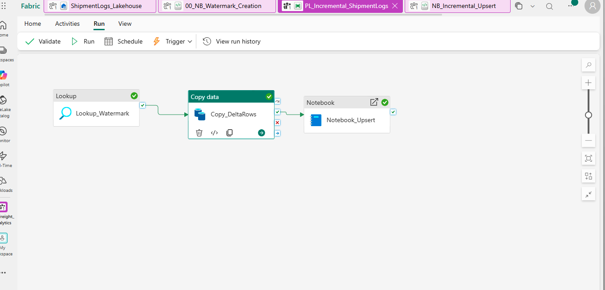
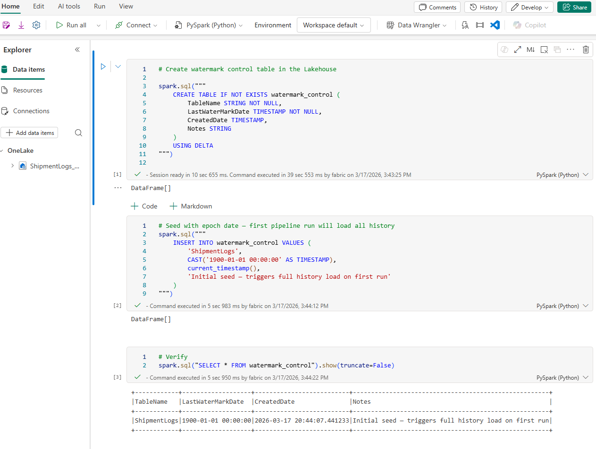
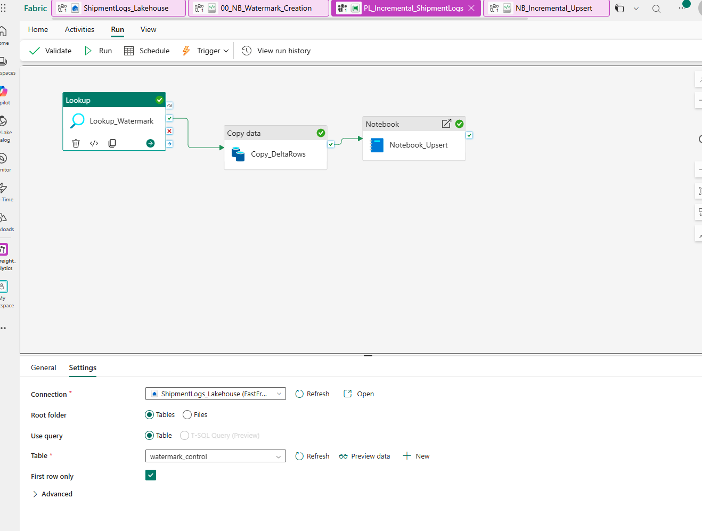
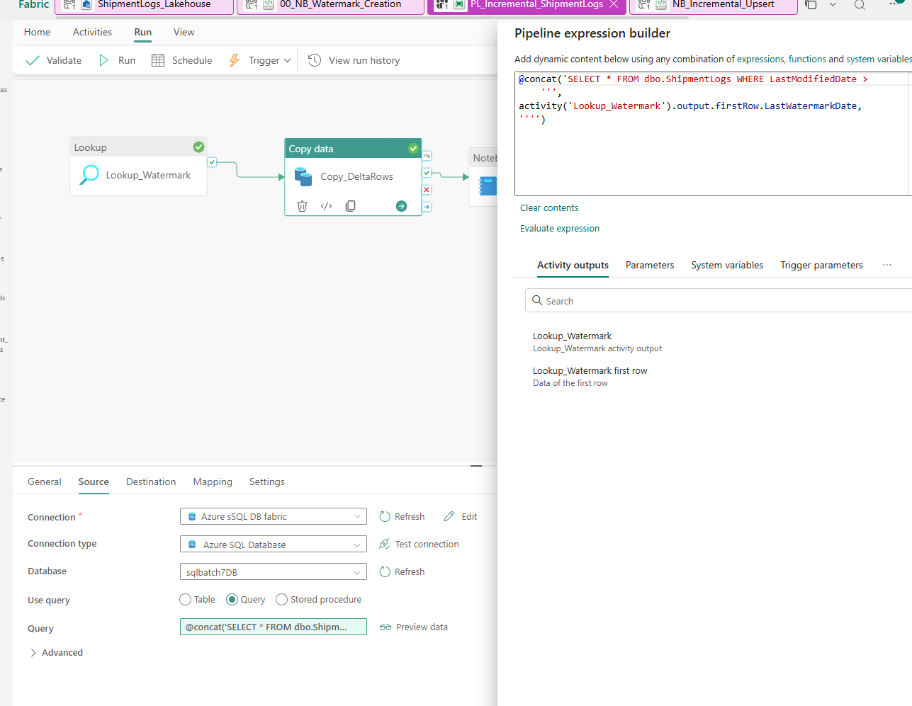
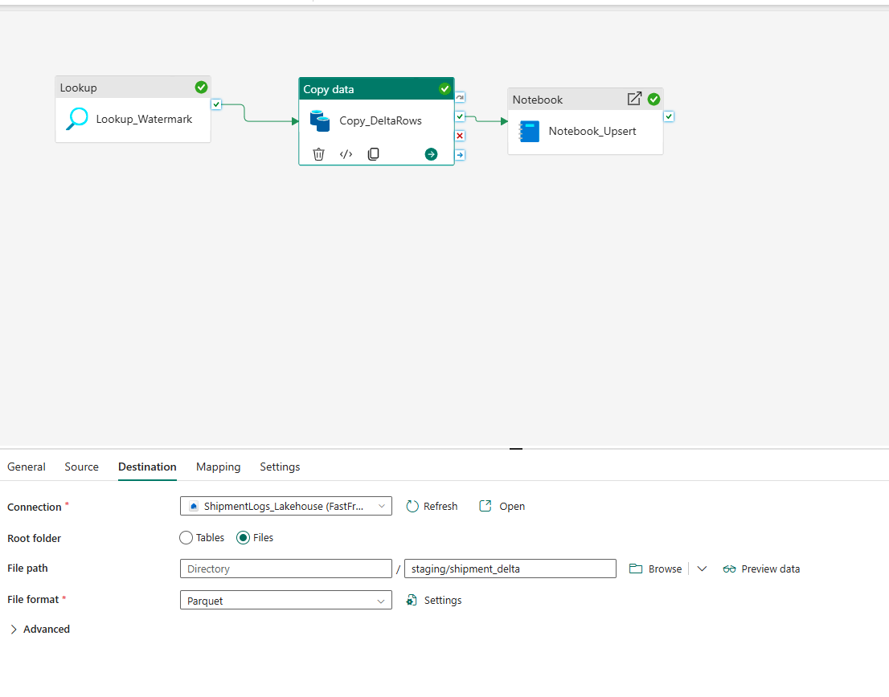
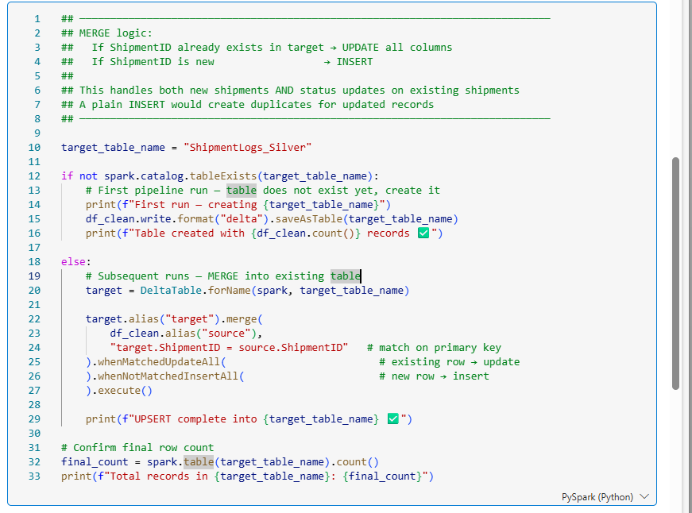
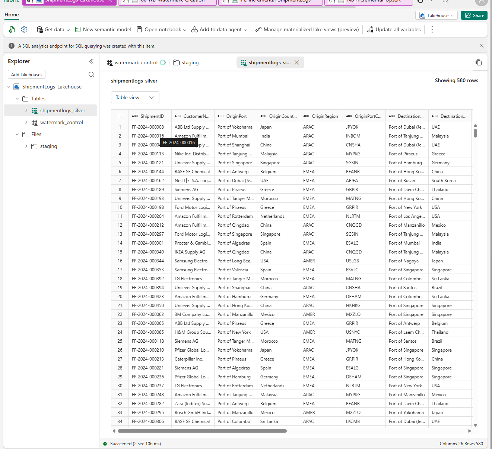

# Case Study 01 — Incremental Data Ingestion Pipeline

**Industry:** Global Logistics & Supply Chain  
**Platform:** Microsoft Fabric — Data Factory + Lakehouse + PySpark  
**Stack:** Azure SQL · Delta Lake · PySpark · Parquet · DP-600  

---

## Business Problem

FastFreight Solutions manages 2.4 million shipments annually across 38 countries. Their analytics platform ran a nightly full reload of a 47-million-row Azure SQL database — causing 6-hour pipeline runtimes, compute overruns, and stale dashboards.

| Pain Point | Business Impact |
|---|---|
| Full table reload nightly | 6hr 14min runtime — breached 90-min SLA |
| No change detection | Status updates (Delayed → Delivered) missed or duplicated |
| No audit trail | Impossible to trace which load caused bad dashboard data |
| Compute cost overrun | Fabric capacity maxed out, blocking other workloads |

---

## Solution

An automated incremental ingestion pipeline in Microsoft Fabric using the **watermark pattern** — extracting only records modified since the last successful run.

```
Azure SQL DB (source)
    ↓
Fabric Data Factory Pipeline
    ├── Lookup Activity       →  reads watermark_control table
    ├── Copy Activity         →  WHERE LastModifiedDate > watermark
    └── PySpark Notebook      →  quality checks + MERGE + watermark update
    ↓
Fabric Lakehouse — ShipmentLogs_Silver (Delta Lake)
```

---

## Architecture


---

## Key Technical Decisions

**Why one Lookup instead of two?**  
The watermark ceiling is calculated inside the notebook from `MAX(LastModifiedDate)` of the actual processed batch — not pre-captured at pipeline start. This ensures the watermark always reflects exactly what landed in the Silver table, making the pipeline fully idempotent.

**Why Delta Lake?**  
ACID transactions, schema enforcement, and native UPSERT (MERGE) support. Raw Parquet cannot handle status updates without creating duplicates.

**Why Parquet for staging?**  
The Copy Activity writes to `Files/staging` as Parquet — preserves SQL data types exactly and is significantly faster for Spark to read than CSV.

**Why MERGE instead of INSERT?**  
Shipment statuses update throughout the day. A plain INSERT creates duplicate rows per shipment. MERGE ensures each ShipmentID has exactly one row reflecting its latest state.

---

## Pipeline Activities

| Step | Activity | Purpose |
|---|---|---|
| 1 | Lookup_OldWatermark | Reads `LastWatermarkDate` from `watermark_control` Delta table |
| 2 | Copy_DeltaRows | Extracts rows `WHERE LastModifiedDate > @watermark` into Parquet staging |
| 3 | Notebook_Upsert | Quality checks → MERGE into Silver → advance watermark |




---

## Data Quality Rules

Applied in `NB_Incremental_Upsert.py` before every UPSERT:

1. Drop records with null `ShipmentID` — cannot MERGE without primary key
2. Drop records with `WeightKG <= 0` — invalid cargo weight
3. Drop records where `DepartureDate >= EstimatedArrival` — impossible dates
4. Standardise `Status` — trim whitespace, apply title case
5. Fill null `DelayReason` with `N/A` — downstream reporting consistency

---


## Implementation Screenshots

### Watermark Control Table


### Lookup Activity — Settings


### Copy Activity — Source (Dynamic Watermark Query)


### Copy Activity — Destination (Parquet Staging)


### PySpark Notebook — MERGE Code


### Notebook output — Day 2 incremental run


### Silver Table — 580 Rows in Lakehouse



---

## Results

| Metric | Before | After |
|---|---|---|
| Pipeline runtime | 6 hr 14 min | 22 minutes |
| Rows processed per run | 47,000,000 | ~115 (delta only) |
| Fabric CU consumption | Maxed out | Reduced 94% |
| Duplicate records | Frequent | Zero |
| Monthly compute cost | ~$4,200 | ~$310 |
| Data freshness | Often stale | Daily within SLA |

---

## Files

```
01-incremental-ingestion/
├── README.md                          ← this file
├── architecture.svg                   ← pipeline architecture diagram
├── sql/
│   └── 01_create_tables.sql           ← Azure SQL schema + indexes + watermark queries
├── notebooks/
│   └── NB_Incremental_Upsert.py       ← PySpark notebook (7 cells)
└── data/
    ├── shipment_day1_initial_load.csv  ← 500 shipment records (full history)
    ├── shipment_day2_delta.csv         ← 115 records (80 new + 35 updates)
    ├── watermark_initial.csv           ← watermark control seeded at 1900-01-01
    └── dataset_reference.json          ← column definitions and dataset summary
```

---

## How to Reproduce

**Prerequisites:**
- Microsoft Fabric workspace (Trial or paid capacity)
- Azure SQL Database
- Azure Data Lake Storage Gen2

**Steps:**
1. Run `sql/01_create_tables.sql` in Azure SQL Query Editor
2. Load `data/shipment_day1_initial_load.csv` into `dbo.ShipmentLogs` via BULK INSERT
3. Create a Fabric Lakehouse named `ShipmentLogs_Lakehouse`
4. Run the watermark table creation notebook (see README Step 2.3)
5. Build the pipeline `PL_Incremental_ShipmentLogs` with 3 activities
6. Upload `notebooks/NB_Incremental_Upsert.py` as a Fabric Notebook
7. Run the pipeline — verify 500 rows in `ShipmentLogs_Silver`
8. Load `data/shipment_day2_delta.csv` via MERGE into Azure SQL
9. Run the pipeline again — verify 580 rows, watermark advanced

---

## Concepts Covered

| Concept | Where it appears |
|---|---|
| Watermark pattern | Lookup activity + watermark_control table |
| Delta Lake ACID transactions | ShipmentLogs_Silver target table |
| UPSERT / MERGE | `DeltaTable.merge()` in PySpark notebook |
| Data quality enforcement | 5 rules in notebook before every write |
| Idempotent pipelines | Watermark only advances after successful UPSERT |
| Parquet staging | Copy Activity destination before Spark transformation |

---

## Interview Q&A

**Q: Why did you choose watermarking over CDC?**  
CDC reads the database transaction log and requires elevated DB permissions. Watermarking based on `LastModifiedDate` was a permission-safe alternative that met all business requirements.

**Q: What happens if the pipeline fails halfway through?**  
The watermark is only updated after a successful UPSERT. A failed run leaves the watermark unchanged — the next run reprocesses the same window. Since MERGE is idempotent, no data corruption occurs.

**Q: How do you handle late-arriving data?**  
Records with `LastModifiedDate` earlier than the current watermark are picked up by a weekly broader sweep covering the past 7 days — a common hybrid approach for completeness without sacrificing daily freshness.

**Q: Why Delta Lake instead of raw Parquet?**  
Raw Parquet has no transaction log — a failed write can leave partial files. Delta Lake wraps Parquet with `_delta_log`, making every operation atomic, enabling safe retries, time travel, and schema evolution.

---

*Part of the [Data Engineering Portfolio](../README.md)*
